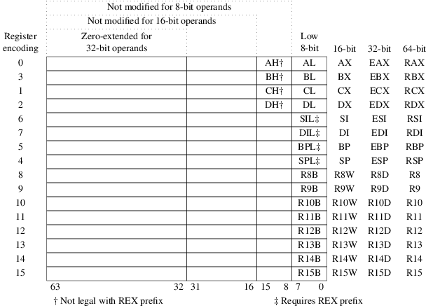

# pwr-ak2-gnu-asm

# GNU Assembler

Poniższy kurs będzie dotyczył programowania przy pomocy języka niskiego poziomu, jakim jest język assembler.

## Środowisko pracy

### Linux

TODO

mkdir | cd | ls | hexdump

### LAK

TODO ssh | scp

### Repozytorium
TODO svn

## Pierwszy program

TODO

```

```

### Składnia

Source: [GAS_Sytnax](https://en.wikibooks.org/wiki/X86_Assembly/GAS_Syntax)

`mov`, `add`, `xor` - mnemonik
`_start:` - etykieta

Wielkość danych na których wykonywany jest rozkaz:

* b = byte (8 bit)
* s = short (16 bit integer) or single (32-bit floating point)
* w = word (16 bit)
* l = long (32 bit integer or 64-bit floating point)
* q = quad (64 bit)
* t = ten bytes (80-bit floating point)

### Rozkazy

#### System call - x64

**Rejestry w 64 bitowym CPU:**



Stałe:
- Wejście: `STDIN = 0`
- Wyjście: `STDOUT = 1`

Przerwanie:
- Dla 64 bit przerwanie wywołuje się poleceniem `syscall`

Source: [System call - x64](http://blog.rchapman.org/posts/Linux_System_Call_Table_for_x86_64/)

| %rax | System call |  %rdi           | %rsi       | %rdx         | | Opis |
|------|-------------|-----------------|------------|--------------|-|------|
| 0    |  sys_read   | unsigned int fd |	char *buf |	size_t count | | Odczyt danych z wejscia do bufora.|

#### Przykład użycia

```
STDIN = 0
SYS_READ = 0
BUFFOR_SIZE = 254

.data
BUFFOR: .space BUFOR_SIZE

.text
.global _start

_start:

mov $SYS_READ, %rax
mov $STDIN, %rdi
mov $BUFFOR, $rsi
mov $BUFFOR_SIZE, $rdx
syscall

```

#### Makra

```assembly
# wypisywanie na konsoli
.macro write str, str_size
	mov $STDOUT, %rdi
	mov $WRITE, %rax
	mov \str, %rsi
	mov \str_size, %rdx
	syscall
.endm
```
#### Makefile

Przykładowy plik:

```makefile
PROG=hello
hello: $(PROG).o
	ld -o $(PROG) $(PROG).o

hello.o: hello.s
	as -g -o $(PROG).o $(PROG).s

clean:
	rm -f $(PROG).o $(PROG)

run: hello
	./$(PROG)

```

Zmienna: `PROG=hello` - przypisz *PROG* ciąg *hello*
Blok:
```makefile
hello: $(PROG).o
	ld -o $(PROG) $(PROG).o
```
czyli
```makefile
polecenie: na obiekcie (wyniku innego polecenia)
	komendy
```

Makfile jeśli podczas wywołania nie podamy żadnego polecenia wywołuje pierwsze z kodu.

#### GDB

Narzędzie do debugowania programu gdb.
Aby działało poprawnie wymaga kompilacji wraz z flagą `-g` zarówno w `as` jak i w `gcc`.

**Polecenia:**
* b[reak] [etykieta] - ustawia breakpointa
* display $rax - wyświetla zawartość rejestru
* info registers - wyświetla informacje o wszystkich rejestrach
